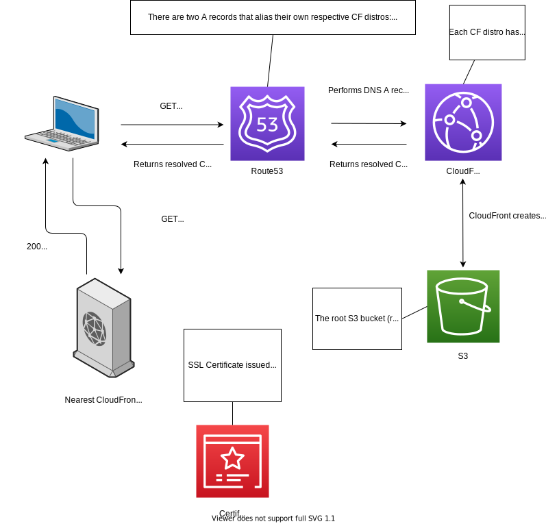

# My "personal website"

I'm not a React expert, or a frontend developer at all really, but I do think I should probably have a "personal website".  
I'll probably look to populate it with some actual content at a later date, but building this was good experience for learning Route 53, Cloudfront, Certificate Manager, and static site hosting via S3.  
Terraform was definitely a pain in some areas where the documentation was very light, or even non-existent (e.g. SSL cert must be created in us-east-1 to be used in a CF distro, CF distros must have a particular origin config to use HTTPS, etc).

## System design
Here is the system layout, quite basic but still very powerful and performant thanks to CloudFront.   
  
  

__TODO__:
- [ ] Refactor infra code into modules, general tidy up
- [ ] Make website pretty
- [ ] Add content to website
